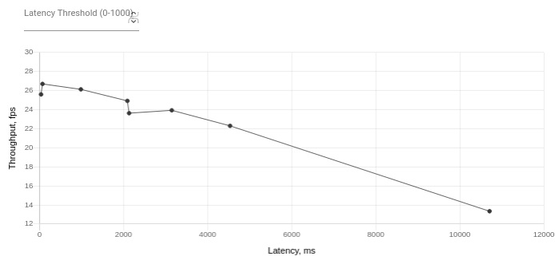
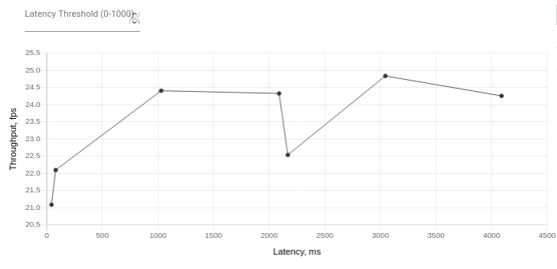
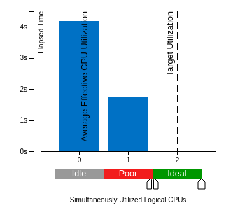

# Computer Pointer Controller

| Details |           |
|----------|---------|
| Dependency | [openvino-2020](https://software.intel.com/content/www/us/en/develop/tools/openvino-toolkit/choose-download.html) |
| Programming language | Python 3.6 or greater |


## What it does

This project is an app that lets the user control the mouse pointer of their computer using their eye gaze. The app uses multiple pretrained computer vision models from the openvino model zoo in a structured pipeline to detect the user's eye gaze and move the mouse pointer in the right distance and direction. 

## How it works

This project uses four different models that work together in a structured pipeline to detect the gaze of the person in the frame and ultimately move the mouse pointer. The models are in their Intermediate representation formats making them compatible with the openvino framework. The app takes in the frame (batch of frames) or image as input and passes it through these models to get the gaze coordinates and then move the mouse pointer:

- [face-detection-adas-0001](https://docs.openvinotoolkit.org/latest/omz_models_intel_face_detection_adas_0001_description_face_detection_adas_0001.html): The first model in the pipeline. This is the model that is used to detect the faces in the video frame (or batch of frames).

- [landmarks-regression-retail-0009](https://docs.openvinotoolkit.org/latest/omz_models_intel_landmarks_regression_retail_0009_description_landmarks_regression_retail_0009.html): This model is paired with the head pose estimation model. Its job is to detect the eyes of the faces detected in the input frame (s).

- [head-pose-estimation-adas-0001](https://docs.openvinotoolkit.org/latest/omz_models_intel_head_pose_estimation_adas_0001_description_head_pose_estimation_adas_0001.html): While the landmark model detects the eyes, this model works on detecting the direction the head is facing (its yaw, pitch and roll). This is known as the head pose. Unlike other models, this model returns angles rather than coordinates.

- [gaze-estimation-adas-0002](https://docs.openvinotoolkit.org/latest/omz_models_intel_gaze_estimation_adas_0002_description_gaze_estimation_adas_0002.html): This is the final model in the pipeline. It takes in the outputs of both the landmark model and the head pose model as input. It, as its name suggests, detects the gaze of the person in the frame. This model returns the cartesion coordinates of the gaze. These coordinates are fed into pyautogui to move the mouse pointer to the position of the gaze.

For technical details about the models please click the model names.


## Project Set Up and Installation

Follow the the steps below to setup this project. Before doing this, make sure you have [the latest version of openvino2020](https://software.intel.com/content/www/us/en/develop/tools/openvino-toolkit/choose-download.html) and the [pyautogui python library](https://pyautogui.readthedocs.io/en/latest/) installed. To follow these instructions  download openvino2020 on [mac OS](https://docs.openvinotoolkit.org/latest/openvino_docs_install_guides_installing_openvino_macos.html), [Linux](https://docs.openvinotoolkit.org/latest/openvino_docs_install_guides_installing_openvino_linux.html), and [Windows 10](https://docs.openvinotoolkit.org/latest/openvino_docs_install_guides_installing_openvino_windows.html). Also visit this [page]() to learn more about the [openvino toolkit](https://docs.openvinotoolkit.org/latest/index.html).

To install the application's requirements. Use the `pip install` command as shown below:

```bash
 pip install -r requirements.txt
```

Now that the required installations are out of the way. We can setup the project:

1. clone it from github using the `git clone` command or download the zipped project from the project github page. 

2. change directory to the download location and unzip the project (if downloaded in zipped format) using the command below:

```bash
 unzip computer-pointer-controller.zip
```

3. source the applications environment.

```bash
source < app storage directory >/computer-pointer-controller/env/bin/activate
```

4. from the app storage directory, go to the app folder and start the application the application. To start the app with the default inputs, enter:

```bash
cd computer-pointer-controller

python3 src/main.py --input_type cam
```
## Project structure

```
.computer-mouse-controller
├── bin
│   └── demo.mp4
├── env
│   ├── bin
│   │   ├── activate
│   │   ├── activate.csh
│   │   ├── activate.fish
│   │   ├── easy_install
│   │   ├── easy_install-3.6
│   │   ├── pip
│   │   ├── pip3
│   │   ├── pip3.6
│   │   ├── python -> python3
│   │   └── python3 -> /usr/bin/python3
│   ├── include
│   ├── lib
│   ├── lib64 -> lib
│   ├── pyvenv.cfg
│   └── share
├── img
│   ├── advanced-benchmark-1000-samples.png
│   ├── advanced-benchmark-100-samples.png
│   ├── effective-cpu-utilization.png
│   └── pipeline.png
├── intel
│   ├── face-detection-adas-0001
│   │   ├── FP16
│   │   │   ├── face-detection-adas-0001.bin
│   │   │   └── face-detection-adas-0001.xml
│   │   └── FP32
│   │       ├── face-detection-adas-0001.bin
│   │       └── face-detection-adas-0001.xml
│   ├── gaze-estimation-adas-0002
│   │   ├── FP16
│   │   │   ├── gaze-estimation-adas-0002.bin
│   │   │   └── gaze-estimation-adas-0002.xml
│   │   └── FP32
│   │       ├── gaze-estimation-adas-0002.bin
│   │       └── gaze-estimation-adas-0002.xml
│   ├── head-pose-estimation-adas-0001
│   │   ├── FP16
│   │   │   ├── head-pose-estimation-adas-0001.bin
│   │   │   └── head-pose-estimation-adas-0001.xml
│   │   └── FP32
│   │       ├── head-pose-estimation-adas-0001.bin
│   │       └── head-pose-estimation-adas-0001.xml
│   └── landmarks-regression-retail-0009
│       ├── FP16
│       │   ├── landmarks-regression-retail-0009.bin
│       │   └── landmarks-regression-retail-0009.xml
│       └── FP32
│           ├── landmarks-regression-retail-0009.bin
│           └── landmarks-regression-retail-0009.xml
├── outputs
│   └── outputs.txt
├── README.md
├── requirements.txt
├── src
│   ├── face_detection.py
│   ├── facial_landmarks_detection.py
│   ├── gaze_estimation.py
│   ├── head_pose_estimation.py
│   ├── input_feeder.py
│   ├── main.py
│   └── mouse_controller.py
└── vtune_scripts
    ├── cpu_script.sh
    └── gpu_script.sh
```

## Demo
The application cintains a sample video which is already setup to be used for a demo. To see a demo of the application, at the root folder of the app execute these comands:

- To use the CPU to view a demo

```bash
python3 src/main.py --input_type demo --precision high
```

## Documentation

The app offers a help command that can describes how each of the arguments should be used.

```bash
python3 src/main.py --help
```

### Usage of CLI commands

Below is a decription of the intended usage of the CLI commands:

```
  -h, --help            show this help message and exit

  -i INPUT, --input_type INPUT
                        (required) specify the input type (Default is "CAM")
                        choices: [video, cam, image, demo]

  -if INPUT_PATH, --input_file INPUT_PATH
                        (optional) Path to input video

  -s SPEED, --speed SPEED
                        (optional) Specify mouse pointer movement speed
                        (Default is "medium") 
                        choices: [fast, medium, slow]

  -p PRECISION, --precision PRECISION
                        (optional) Specify mouse pointer movement precision
                        (Default is "high") 
                        choices: [high, medium, low]

  -fm MODEL_PATH, --face_model MODEL_PATH
                        (optional) Path to model xml file (enter the file name
                        without .xml extension)
                        Precisions available: [FP32, FP16, INT8]

  -fde DEVICE_EXTENSION, --face_device_ext DEVICE_EXTENSION
                        (optional) Path to device extension library with the
                        kernels implementation.

  -fd DEVICE, --face_device DEVICE
                        (optional) Specify target device for inference.
                        (Default is "CPU") choices: [CPU, GPU, FPGA, MYRIAD,
                        HETERO:GPU,CPU, MULTI:MYRIAD,GPU,CPU, MULTI:MYRIAD,CPU, 
                        HETERO:FPGA,MYRIAD,GPU, HETERO:FPGA,CPU, HETERO:FPGA,GPU]

  -fpt PROB_THRESHOLD, --face_prob_threshold PROB_THRESHOLD
                        (optional) Probability threshold for Face detection
                        model. (Default is 0.5)

  -flm MODEL_PATH, --face_landmark_model MODEL_PATH
                        (optional) Path to model xml file (enter the file name
                        without .xml extension)
                        Precisions available: [FP32, FP16, INT8]

  -flde DEVICE_EXTENSION, --face_landmark_device_ext DEVICE_EXTENSION
                        (optional) Path to device extension library with the
                        kernels implementation.

  -fld DEVICE, --face_landmark_device DEVICE
                        (optional) Specify target device for inference.
                        (Default is "CPU") 
                        choices: [CPU, GPU, FPGA, MYRIAD, HETERO:GPU,CPU, 
                        MULTI:MYRIAD,GPU,CPU, MULTI:MYRIAD,CPU, HETERO:FPGA,MYRIAD,GPU,
                        HETERO:FPGA,CPU, HETERO:FPGA,GPU]

  -flpt PROB_THRESHOLD, --face_landmark_prob_threshold PROB_THRESHOLD
                        (optional) Probability threshold for the Facial
                        landmark detection model. (Default is 0.5)

  -hpm MODEL_PATH, --head_pose_model MODEL_PATH
                        (optional) Path to model xml file (enter the file name
                        without .xml extension)Precisions available: [FP32,
                        FP16, INT8]

  -hpde DEVICE_EXTENSION, --head_pose_device_ext DEVICE_EXTENSION
                        (optional) Path to device extension library with the
                        kernels implementation.

  -hpd DEVICE, --head_pose_device DEVICE
                        (optional) Specify target device for inference.
                        (Default is "CPU") 
                        choices: [CPU, GPU, FPGA, MYRIAD, HETERO:GPU,CPU, 
                        MULTI:MYRIAD,GPU,CPU, MULTI:MYRIAD,CPU, 
                        HETERO:FPGA,MYRIAD,GPU, HETERO:FPGA,CPU, HETERO:FPGA,GPU]

  -hppt PROB_THRESHOLD, --head_pose_prob_threshold PROB_THRESHOLD
                        (optional) Probability threshold for Head Pose
                        detection model. (Default is 0.5)

  -gm MODEL_PATH, --gaze_model MODEL_PATH
                        (optional) Path to model xml file (enter the file name
                        without .xml extension)
                        Precisions available: [FP32, FP16, INT8]

  -gde DEVICE_EXTENSION, --gaze_device_ext DEVICE_EXTENSION
                        (optional) Path to device extension library with the
                        kernels implementation.

  -gd DEVICE, --gaze_device DEVICE
                        (optional) Specify target device for inference.
                        (Default is "CPU") 
                        choices: [CPU, GPU, FPGA, MYRIAD, HETERO:GPU,CPU, 
                        MULTI:MYRIAD,GPU,CPU, MULTI:MYRIAD,CPU, 
                        HETERO:FPGA,MYRIAD,GPU, HETERO:FPGA,CPU, HETERO:FPGA,GPU]

  -gpt PROB_THRESHOLD, --gaze_prob_threshold PROB_THRESHOLD
                        (optional) Probability threshold for Face detection
                        model. (Default is 0.5).

  -all_dev DEVICE, --all_devices DEVICE
                        (optional) Specify all target devices at once.
                        (Default is "CPU") 
                        choices: [CPU, GPU, FPGA, MYRIAD, HETERO:GPU,CPU, 
                        MULTI:MYRIAD,GPU,CPU, MULTI:MYRIAD,CPU, HETERO:FPGA,MYRIAD,GPU,
                        HETERO:FPGA,CPU, HETERO:FPGA,GPU]

  -b BATCH, --batch_size BATCH
                        (optional) Batch size of input for inference. (Default
                        is 30).
 
  --output_path OUTPUT_PATH
                        (optional) Specify output directory (Default is
                        outputs/).

  --show_output SHOW_OUTPUTS
                        (optional) Display detection results and draw face and
                        eyes boundingboxes on the video frame (Default is
                        False).
```

## Benchmarks
The model benchmark tests were performed using the provided demo file as input The models load times, average inference speed and total inference times benchmark tests were performed on a single CPU device:

- Intel(R) Core(TM) i5-8250U CPU @1.60GHz

### Benchmark scenarios

The scenarios used include: 

1. CPU Hardware with Model precision FP16

    command used:

    ```bash
    python3 src/main.py --input_type demo --precision high --batch_size <batch size choice>
    ```

2. CPU Hardware with Model precision FP32

command used:
    
    ```bash
    python3 src/main.py --input_type demo --face_model intel/face-detection-adas-0001/FP32/face-detection-adas-0001 --face_landmark_model intel/landmarks-regression-retail-0009/FP32/landmarks-regression-retail-0009 --head_pose_model intel/head-pose-estimation-adas-0001/FP32/head-pose-estimation-adas-0001 --gaze_model intel/gaze-estimation-adas-0002/FP32/gaze-estimation-adas-0002 --precision high --batch_size <batch size choice>
    ```

The results of these benchmark scenarios can be found in the Results section


## Results

This sections contains results of benchmark tests on the model performed with the CPU hardware, using FP32 and FP16 model precisions and the batch size ranging from 1 to 100. The inference times and speeds have been approximated to two decimal places. The demo video file was used as input for the benchmark tests.

#### Result Table

| Hardware | Models Precisions |  Batch size | Total model init time (s) | Total Model Load Time (s) | App init Time (s) | Total inference time (s) | Avg. Inference speed (fps) |
|----------|-------------------|-------------|---------------------------|---------------------------|-------------------|--------------------------|------------------------------|
| CPU  | FP32 | 1   | 0.10 | 0.71 | 0.81 | 31.52 | 19.04 |
| CPU  | FP16 | 1   | 0.07 | 0.67 | 0.75 | 30.97 | 19.21 |
| CPU  | FP32 | 25  | 0.07 | 0.73 | 0.80 | 1.29  | 18.47 |
| CPU  | FP16 | 25  | 0.06 | 0.73 | 0.79 | 1.46  | 14.72 |
| CPU  | FP32 | 50  | 0.08 | 0.79 | 0.87 | 0.74  | 12.80 |
| CPU  | FP16 | 50  | 0.05 | 0.74 | 0.80 | 0.73  | 14.10 |
| CPU  | FP32 | 75  | 0.08 | 0.71 | 0.78 | 0.42  | 16.18 |
| CPU  | FP16 | 75  | 0.06 | 0.59 | 0.64 | 0.34  | 19.39 |
| CPU  | FP32 | 100 | 0.11 | 0.67 | 0.78 | 0.31  | 16.28 |
| CPU  | FP16 | 100 | 0.07 | 0.59 | 0.66 | 0.34  | 13.47 |

#### Summary of Results

From the benchmarking results above, We can deduce that the models initialize and load faster at FP16 precision. This faster models load time shortens the application's initialization time allowing the application to start up faster at FP16 model precision than when the models are at FP32 precision. The inference speed falls within a range of values but it peaks at the batch size of 1 for both precisions. Also, The average inference speed is lowest when the batch size is 50. The total inference time of the application spikes when batch size is 1 and drops to about 1.30s at bach size 25 and slowly declines as the batch size is increased.  

It was also noted that all batch sizes ran in the application with all models at FP16 precision had lower times than the FP32 precisions, this is because the FP32 requires twice as much FLOPs as the FP16 precision. This higher FLOP requirement means that the FP32 precision will require significantly higher processing power to perform inference in the same time as FP16 models. As a result, given the same resources and the same number of input frames as its FP16 counterpart, the FP32 precision would take a longer amount to time to perform inference on the input frames than FP16 precision.

In conclusion, the choice of precision and batch size is dependendent on end-user needs. The FP16 with a batch size of 100 is best if the user want the inference performed in the shortest amount of time possible. For a faster application startup, the FP16 precision is recommended and for a good trade-off between average inference speed and total inference time, the FP32 precision with an input batch size of 50 would be the best choice. To ensure the best possible experience while using the app in 'cam' mode, the app has a default `batch size of 30` (the record rate of the standard camera), all models are at `FP16 precision` and performs inference using the device `CPU`.


## Stand Out Suggestions

### Inference pipeline for both video and webcam feed as input

The inference pipeline of this project allows using for both video and webcam as input by utilizing the CLI using the `--input_type` and `--input_file` commands. The pipeline also allows for a third input to access a demo of the app at in action.

#### 1. Using webcam feed as input

To use the webcam feed, your computer must have an integreted webcam or a webcam connected to it via USB port or some other compatible input. Once, this is confirmed, you can use the camera feed by entering "cam" as the argument for the `--input_type` command and not entering anything for the `--input_file` command. Enter the command in this format.

```bash
python3 src/main.py --input_type cam
```

#### 2. Using a video as input

To use a video file as input, have the video stored in your device. Use the video file by entering 'video' as the `--input_type` command and the path to the video file as the argument for the `--input_file` command. Type the following commands in the following format.

```bash
python3 src/main.py --input_type video --input_file <video file path>
```

#### 3. Using demo as input

The app includes a third input option called `demo`. This option allows the user view a demo of the app. The app uses a sample video file which has been provided to display the demo. The user has the option of selecting their own input file by using the `--input_file` command.

```bash
python3 src/main.py --input_type demo --precision high
```

### Async Inference
I
 Advanced benchmarking was performed on the application using the DL workbench. Each of the models were benchmarked and their average was latency and throughput was calculated for both sync and async inference. Two datasets were generated and used for this test. One contained 100 samples and the other 1000 samples. The tests were performed with 1 stream (for sync inference) and 2 streams (for async inference) with batch size ranging from 1 to 75 at an interval of 25. The benchmarking tests were perfomed with both FP16,FP32 selection of the models from the set available on the open model zoo on the same tests. The results were an average of the latency and throughput of both precisions. The benchmark results are shown below:

#### 100 Samples dataset

 | Hardware  | Batch size | streams | Inference type | model Latency (ms) | model throughput (fps) |
|------------|------------|---------|----------------|---------------------|--------------------------|
| CPU  | 1   | 1  | sync  | 36.78 | 25.6 |
| CPU  | 1   | 2  | Async | 71.46 | 26.70 | 
| CPU  | 26  | 1  | sync  | 984.44 | 26.13 |
| CPU  | 26  | 2  | Async | 2091.21 | 24.92 |
| CPU  | 51  | 1  | sync  | 2132.31 | 23.63 |
| CPU  | 51  | 2  | Async | 4534.11 | 22.30 |
| CPU  | 76  | 1  | sync  | 3147.46 | 23.93 |
| CPU  | 76  | 2  | Async |10707.96 | 13.34 |

#### 1000 Samples dataset

 | Hardware | Models Precisions |  Batch size | streams | Inference type | model Latency (ms) | model throughput (fps) |
|----------|--------------------|-------------|----------|---------------|--------------------|-------------|
| CPU  | FP16 | 1   | 1  | sync  | 42.72   | 21.09 |
| CPU  | FP16 | 1   | 2  | Async | 80.18   | 22.10 |
| CPU  | FP16 | 26  | 1  | sync  | 1028.79 | 24.41 |
| CPU  | FP16 | 26  | 2  | Async | 2089.53 | 24.33 |
| CPU  | FP16 | 51  | 1  | sync  | 2167.32 | 22.54 |
| CPU  | FP16 | 51  | 2  | Async | 3044.62 | 24.84 |
| CPU  | FP16 | 76  | 1  | sync  | 4089.82 | 24.26 |
| CPU  | FP16 | 76  | 2  | Async | 4095.45 | 25.78 |

#### GRAPH OF 100 SAMPLE DATASET



#### GRAPH OF 1000 SAMPLE DATASET



#### Summary of Results

For the 100-sample dataset benchmark, as the batch size increased, the latency of the model increased as well. The 1000 sample dataset benchark tests record slightly lower latency than the 100 dataset benchmark tests. At a batch size of 1, the difference in latency of the sync and async inferences was neglidgible but this difference continued to increase as the batch size was increased till it became a very large differences of thousands of milliseconds. The trend suggests that the difference would continue to increase as the batch size increases. The throughput was also higher for throughput for async inferebce than there was for syync inference. Because of the increasing difference in model latency of sync and async inference, a maximum batch size of 30 is recommended.

The 1000-sample-dataset benchmark results seemed to follow a linear treand with some outliers at certain intervals. The result showed steady throughput values with a few outliers at the later stages of the graph. As the batch-size was increasing, the Latency seems to increase linearly with increase in batch size.

In conclusion, There is higher latency for async inference than for sync inference. The throughput is higher for sync inference than for Async inference.  sync inference would be better for optimal performance if the application will be used for long hours.


### Inference Pipeline Hotspot Analysis

#### CPU used

Name:	Intel(R) Processor code named Kabylake ULX
Frequency:	1.8 GHz 
Logical CPU Count:	2


#### Data Collection stats

Elapsed Time:	7.661s
CPU Time:	2.180s
Total Thread Count:	21
Paused Time:	0s
Parallelism:   13.3%
Microarchitecture Usage: 23.2%


#### Top Hotspots

| Function | Module |	CPU Time |
|----------|--------|------------|
| PyCFunction_Call |	python3.6 | 0.353s |
|  OS_BARESYSCALL_DoCallAsmIntel64Linux | libc-dynamic.so	| 0.303s |
| func@0x50a290 | python3.6	| 0.290s |
| std::__malloc_alloc::allocate |	libstlport-dynamic.so | 0.166s |
| sched_yield | libc.so.6 | 0.140s |
| [Others]	| N/A* | 0.928s |

#### Top Tasks

| Task Type | Task Time | Task Count |
| void cv::utils::logging::LogTagManager::assign(const string&, cv::utils::logging::LogTag*)| 0.000s | 1 |
| cv::utils::logging::LogTag* cv::utils::logging::LogTagManager::get(const string&) |	0.000s | 1 |

#### Effective CPU Utilization Table

| Simultaneously Utilized Logical CPUs | Elapsed Time | Utilization threshold |
| 0 | 5.3801632009 | Idle |
| 1	| 2.280570021 | Poor |
| 2 |	0	|  Ideal |



#### Summary of Results

The VTune Amplifier was used to perform an analysis on the inference pipeline to fine the top hotspots in the application. The data collection and collation was performed in 7.661s, 2.180s out of which was used by the CPU to actively execute the application. A total of 21 threads were used by the CPU. The Hotspots insights section of the summary showed that the application utilized only 1 CPU core with a 13.3% parallelism and a microarchitecture usage of 23.2%.

The top hotspots of the inference pipeline consisted of python function calls and system library calls. The highest CPU time spent by topmost hotspot function was 0.353s. The time taken for the top five hotspot functions ranged from 0.140s to 0.353s with the rest of the hotspot functions' times totaling to 0.928s. All of the top hotspot functions are optimized by their developers and as such take the least amount of time possible to complete their operations.

A parallelism score of 13.3% is a very low score. It means that the available CPU cores are under-utilized by the application. Rather than split its inference load to take advantage of the multiple cores available on the CPU to speed up inference, the application threads its inference operations on one core overtasking it and as a result leaves the other cores idle  for most of the inference period as shown in the Effective CPU Utilization Table above. This can be corrected by threading the inference process to the multiple cores availabe to shorten the inference processing time and maximize efficiency. Efficiency improvement options can be explored through further analysis using the threading feature of the VTune amplifier.

A 23.2% microarchitecture usage suggests that the code does run effectively on the CPU microarchitecture used for this test. This could be as a result of long-latency memory, floating-point, or SIMD operations, non-retired instructions due to branch mispredictions or instruction starvation in the front-end. Further analysis of this can be performed using the Microarchitecture Exploration feature of the VTune amplifier to dertermine the exact cause of the poor microarchitecture usage and then improve it.

Although the application recorded low parallelism and microarchitecture usage, the application still performs inference at high speeds. This could however be improved by threading the application to utilize multiple cores and reducing the applications potential reliance on long-latency memory.


### Let the user see Inference stats and Last outputs

The application logs inference stats and last outputs that were made by each of the models in the pipeline before the inference ended or was interrupted. This is to enable the user assess the applicaion's performance on their device and also make debuging and further analysis of the application a lot easier. The logged statistics and outputs are stored in an `output.txt` file which can be found in the `computer-pointer-controller\outputs\outputs.txt` directory.

The application also logs the Gaze vector outputs and inference statistics in the CLI while performing inference to help the debugger backtrack or debug the application.

#### Logged inference stats

- App initialization time: Time taken to initialize and load all the models and also initialize app methods and attributes.

- Total processing time: Total time taken to process all the batches before ending inference or interuption.

- Average inference speed: Average batch processing speed of the application.

- Batch count: Number of batches processed before inference was finished or interrupted.

#### Logged Last outputs
- Face coordinates: Coordinates of the first face in the frame detected by the face detection model.

- Left eye coordinates: Coordinates of the left eye of the face detected by the facial landmark model.

- Right eye coordinates: Coordinates of the right eye of the face detected by the facial landmark model.

- Head pose angles: Yaw, pitch and roll of the first head in the frame. This is detected by the head pose model. 

- Relative pointer coordinates/ Gaze vector: The cartesian vector coordinates of the gaze direction vector of the first head in the frame. This is detected by the gaze estimation model and is used as relative coordinates (distance between the current and new pointer positions on the screen) to calculate new cordinates to move the mouse pointer to.


### Edge Cases

There were some situations I encountered that broke the inference flow during testing. These are the cases written about in these section.

#### Multiple People cases

There are some instances where multiple faces were detected in the camera feed. This caused the application to crash as it because the landmark and head pose models can only take in one cropped face image at a time as input. To deal with this problem, I cropped out only the first face that was detected by the face detection model as input for the facial landmarks and head pose estimation models. The first detected face is usually the leftmost face in the frame. All other detected faces will be ignored.

#### Lighting Changes Case

In cases of low lighting, the faces in the frames might not be detected by the application. this causes the application. This is because low lighting conditions mean the brightness and contrast of the video frames would be to low to be able to visually detect any objects in the image. On the flip side of it, the high lighting case would raise the brightness and contrast of the input frames too high and obscure any faces in the frame making them undetrctable to the face detection model. Both situations are polar opposites of the same problem, which is keeping the brightness and contrast values of the frames at the optimal range of values for inference. To achive this, I installed a package called [Gucview](http://guvcview.sourceforge.net/Doc.html), which is available for linux, to automatically enhance the camara's image capturing to better detect faces in poor lighting conditions. This widens the optimal range of values of the input frames making it a lot more likely that the models will be able to detect the faces, landmarks and gaze of people in the frames.

To install this package, the installation commands are:
```bash
sudo apt-get update -y

sudo apt-get install -y guvcview
```

#### Blank video frame or empty webcam input

In the case where a blank video is passed in as input or the camera doesn't detect any faces in the frame the app would flag that as an error and move on to the next frame. The app would go throught the entire input this way. The block of code in lines 275 - 283 of the main.py file does just this. Below is a snippet of it:

```bash
                if self.face_coords == []:
                    log.info('[ Main ] No face detected.. Waiting for you to stare at the camera')
                    f.write('[ Error ] No face was detected')
                    
                else:
                    self.head_pose_angles=self.head_pose_model.predict(self.face_crop)
                    self.left_eye_coords, self.left_eye_image, self.right_eye_coords, self.right_eye_image=self.landmarks_model.predict(self.face_crop)
                    self. x, self.y = self.gaze_model.predict(self.left_eye_image, self.right_eye_image, self.head_pose_angles)
                    log.info(f'[ Main ] Relative pointer coordinates: [{self.x:.2f}, {self.y:.2f}]')
```
